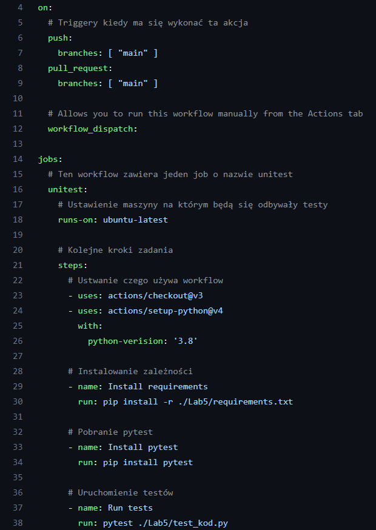

# Sprawozdanie Lab5, Lab6, Lab7

## GITHUB Actions
---

### Operacje związane z automatyzacją testów jednostkowych.

1. Utworzony został kod zawierający 4 funkjce (odejmowanie, mnożenie, dzielenie) oraz jedna funkcja zawierająca obliczanie średniej z biblioteki numpy.
    ```python
    import numpy as np

    def sub(a: float, b: float) -> float:
        return a - b

    def mul(a: float, b: float) -> float:
        return a * b

    def div(a: float, b: float) -> float:
        if b == 0:
            raise Exception("Can't divide by 0")
        return a / b

    def mean(a) -> float:
        return np.mean(a)
    ```

2. Utorzenie Unitestów testujących funkcje, testują poprawność również przy próbie podzielenia przez 0.
    ```python
    import kod
    import pytest
    class Testing:
        def test_sub(self):
            assert kod.sub(3,5) == -2, "should be -2"
        
        def test_mul(self):
            assert kod.mul(2,2) == 4, "should be 4"

        def test_div(self):
            assert kod.div(8, 2) == 4, "should be 4"
            
        def test_div_by_0(self):
            with pytest.raises(Exception, match="Can't divide by 0"):
                kod.div(2, 0) 
                
        def test_mean(self):
            assert kod.mean([3,4,5]) == 4, "should be 4"
    ```

2. Uruchomienie unitestów lokanie w celu weryfikacji - wszystke przechodzą.
    <br>
    

3. Utworzenie git action, który zbuduje środowisko oraz uruchomi testy na gałęzi main po wrzuceniu commita.
    <br>
    

4. Potwierdzenie wykonywania kodu po zrealizowaniu commita.
   <br>
   