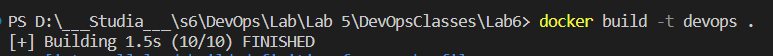
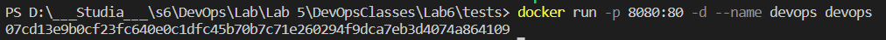
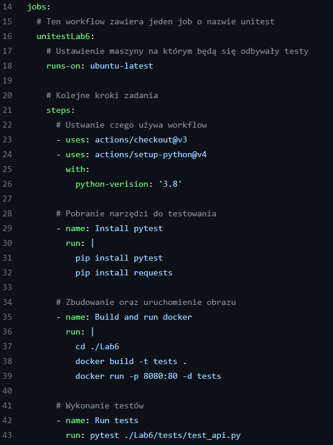

# Sprawozdanie Lab5, Lab6, Lab7

## GITHUB Actions
---

### Operacje związane z automatyzacją testów jednostkowych.

1. Utworzony został kod zawierający 4 funkjce (odejmowanie, mnożenie, dzielenie) oraz jedna funkcja zawierająca obliczanie średniej z biblioteki numpy.
    ```python
    import numpy as np

    def sub(a: float, b: float) -> float:
        return a - b

    def mul(a: float, b: float) -> float:
        return a * b

    def div(a: float, b: float) -> float:
        if b == 0:
            raise Exception("Can't divide by 0")
        return a / b

    def mean(a) -> float:
        return np.mean(a)
    ```

2. Utorzenie unit testów testujących funkcje, testują poprawność również przy próbie podzielenia przez 0.
    ```python
    import kod
    import pytest
    class Testing:
        def test_sub(self):
            assert kod.sub(3,5) == -2, "should be -2"
        
        def test_mul(self):
            assert kod.mul(2,2) == 4, "should be 4"

        def test_div(self):
            assert kod.div(8, 2) == 4, "should be 4"
            
        def test_div_by_0(self):
            with pytest.raises(Exception, match="Can't divide by 0"):
                kod.div(2, 0) 
                
        def test_mean(self):
            assert kod.mean([3,4,5]) == 4, "should be 4"
    ```

2. Uruchomienie unit testów lokanie w celu weryfikacji - wszystke przechodzą.
    <br>
    

3. Utworzenie git action, który zbuduje środowisko oraz uruchomi testy na gałęzi main po wrzuceniu commita.
    <br>
    

4. Potwierdzenie wykonywania kodu po zrealizowaniu commita.
   <br>
   


## GITHUB Actions - testy funckjonalne + build
---

### Operacje związane z automatyzacją testów funkconalnych dla aplikacji REST API

1. Utworzonie kodu zawierającego 3 funkcje (odejmowania, mnożenia, dzielenia), które są podpięte do różnych endpointów. Dla funkcji z dzieleniem podczas próby dzielenia przez 0 zwracay zostaje bad request (400).
   ```python
   #Endpoint, który odejmuje
   @app.route('/api/sub', methods=['GET'])
    def sub():
        try:
            a = float(request.args.get('a'))
            b = float(request.args.get('b'))
            result = apiservice.sub(a, b)
            response = Response(str(result), 200)
            return response
        except:
            return Response('Bad request', 400)
    #Endpoint, który mnoży
    @app.route('/api/mul', methods=['GET'])
    def mul():
        try:
            a = float(request.args.get('a'))
            b = float(request.args.get('b'))
            result =  apiservice.mul(a, b)
            response = Response(str(result), 200)
            return response
        except:
            return Response('Bad request', 400)
    #Endpoint, który dzieli
    @app.route('/api/div', methods=['GET'])
    def div():
        try:
            a = float(request.args.get('a'))
            b = float(request.args.get('b'))
            result =  apiservice.div(a, b)
            response = Response(str(result), 200)
            return response
        except:
            return Response('Bad request', 400)
   ```

2. Napisanie testów dla każdego endpointa, również w przypadku gdy do funkcji dzielącej zostanie podane 0 w mianowniku.
    ```python
    def test_sub():
        a = '3.0'
        b = '2.0'
        result = b'1.0'
        r = requests.get('http://localhost:8080/api/sub?a='+a+'&b='+b)
        assert r.status_code==200
        assert r.content== result

    def test_mul():
        a = '3.0'
        b = '3.0'
        result = b'9.0'
        r = requests.get('http://localhost:8080/api/mul?a='+a+'&b='+b)
        assert r.status_code==200
        assert r.content== result

    def test_div():
        a = '4.0'
        b = '2.0'
        result = b'2.0'
        r = requests.get('http://localhost:8080/api/div?a='+a+'&b='+b)
        assert r.status_code==200
        assert r.content== result

    def test_div_by_0():
        a = '4'
        b = '0'
        r = requests.get('http://localhost:8080/api/div?a='+a+'&b='+b)
        assert r.status_code==400
    ```
    
3. Stworzenie Dockerfile, który osadza aplikacje rest API w kontenerze.
    ```Dockerfile
    FROM python:3.8

    COPY app/requirements.txt ./
    RUN pip install --no-cache-dir -r requirements.txt
    EXPOSE 80

    WORKDIR /app
    COPY app/ .

    ENTRYPOINT ["python", "api.py"]
    ```

4. Zbudowanie oraz uruchomienie obrazu lokalnie.
    <br>
    
    <br>
    

5. Uruchomienie testów lokalnie.
    <br>
    

6. Stworzenie git action, który po commitowaniu buduje aplikację oraz wykonuje testy. Pokazany został istoty fragment pliku.
    <br>
    

7. Sprawdzenie poprawności testów na githubie.
    <br>
    


## GITHUB Actions - testy funckjonalne + build
---

### Operacje związane z automatyzacją testów, budowaniem aplikacji oraz wrzuceniem w docker huba.

1. Utworzone zostały 3 branche: test, dev, dev_feature_1.
    <br>
    

2. Utworzenie akcji uruchamiającej unit testy w momencie pull requesta wykonywanego na gałąź dev. Fragment pliku:
    <br>
    

3. Utworzenie akcji uruchamiającej testy funkcjonalne w momencie pull requesta wykonywanego na gałąź test. Fragment pliku:
   <br>
    

4. Utworzenie akcji, która wykonuje push do docker hub'a po połączeniu na gałęzi test. 
    <br>
    

5. Aby możliwe było połączenie z docker hub należy utworzyć sekrety.
    <br>
    

6. Zmodyfikowanie plików tak, by nie przechodziły testów.Próba wykonania merga gałęzi dev_feature_1 do dev.
    <br>
    

7. Sprawdzenie powodu niepowodzenia.
    <br>
    

8. Naprawienie pliku.
    <br>
    

9.  Próba wykonania merga gałęzi dev do test.
    <br>
    

10. Sprawdzenie powodu niepowodzenia.
    <br>
    

11. Naprawienie pliku.
    <br>
    

12. Wykonanie merga.
    <br>
    

13. Sprawdzenie poprawności działania pusha do docker huba.
    <br>
    

14. Na docker hub sprawdzenie dodania obrazu.
    <br>
    


